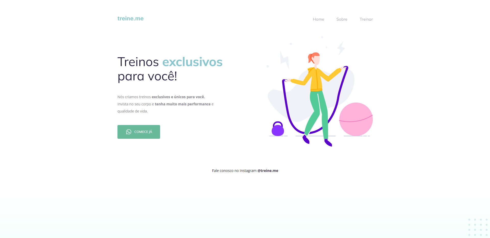

<h1 align="center"> Treine.me - Semântica e Acessibilidade</h1>

Exercício de aplicação de semântica e acessibilidade. 
Neste desafio recebemos um código e o objetivo era aplicar semântica e acessibilidade a ele. 

A imagem abaixo representa a página sem aplicação da semântica e da acessibilidade, onde podemos ver que a página não apresenta muitas difereças visuais. Porém, por exemplo, devido a falta de semântica e acessibilidade na elaboração do código, pessoas que utilizam leitores de tela podem ter dificuldades para entender o conteúdo e navegar na página.
 
Na seção Projeto Finalizado você pode verificar o resultado final do desafio. 
  

  <a href="#-tecnologias">Tecnologias</a>&nbsp;&nbsp;&nbsp;|&nbsp;&nbsp;&nbsp;
  <a href="#-projeto-finalizado">Projeto Finalizado</a>&nbsp;&nbsp;&nbsp;|&nbsp;&nbsp;&nbsp;
  <a href="#-layout">Layout</a>&nbsp;&nbsp;&nbsp;|&nbsp;&nbsp;&nbsp;
  <a href="#-agradecimentos">Agradecimentos</a>

 

## 🚀 Tecnologias

Esse projeto foi desenvolvido com as seguintes tecnologias:

- HTML
- CSS
- Git e Github
- Figma

## 💻 Projeto Finalizado

A imagem abaixo é uma prévia do projeto finalizado. Além disso, todos os detalhes do projeto podem ser verificados através do link abaixo.

  
<a href="https://treineme-semantica-acessibilidade.vercel.app/" target="_blank"><strong> - Clique aqui para acessar o meu projeto finalizado.</strong></a>

## 🔖 Layout

Você pode visualizar o layout original do projeto através <a href="https://www.figma.com/file/rkDOHGPwwFtBNqEdHSuQPd/Projeto-02---Explorer?node-id=0%3A1&mode=dev" target="_blank">DESSE LINK</a> . É necessário ter conta no <a href="https://figma.com" target="_blank">Figma</a> para acessá-lo.

## 💜 Agradecimentos

Um agradecimento especial a <b>Rocketseat</b> por todos os projetos educacionais e por estimular o aprendizado em comunidade. 🚀
<a href="https://discord.gg/rocketseat" target="_blank">Participe da nossa comunidade!</a>